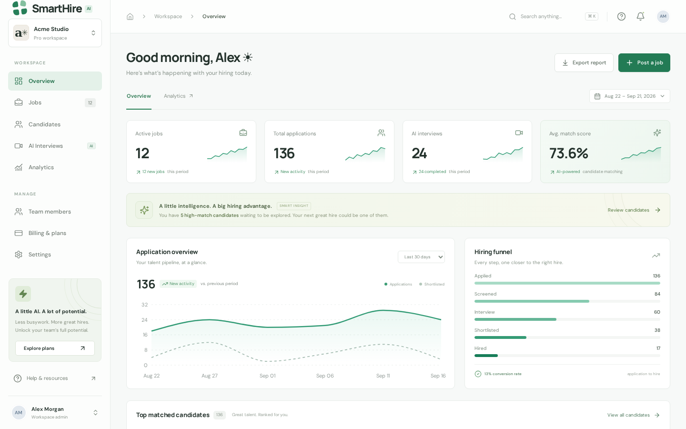
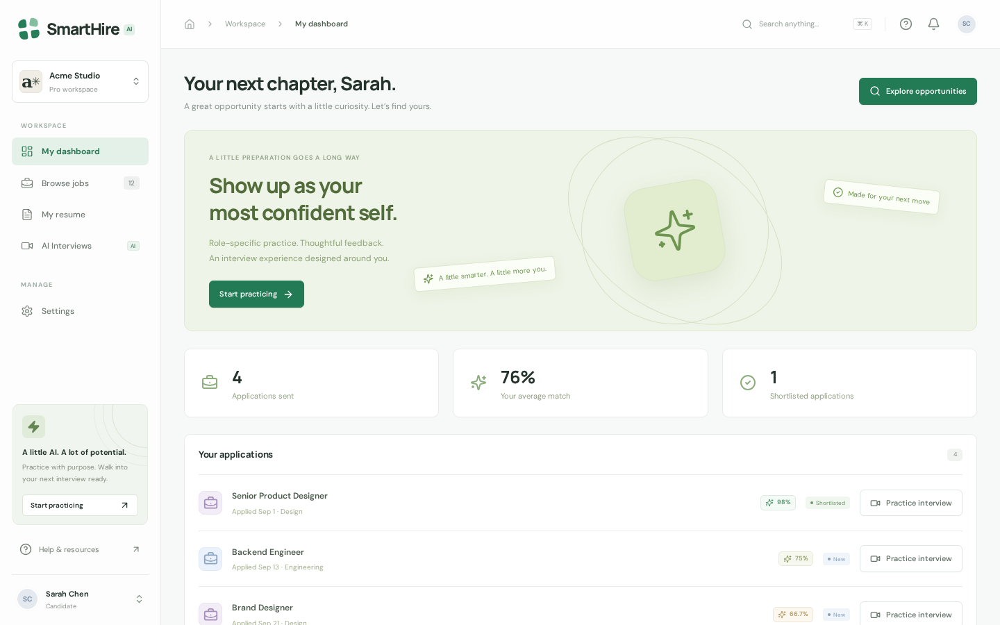
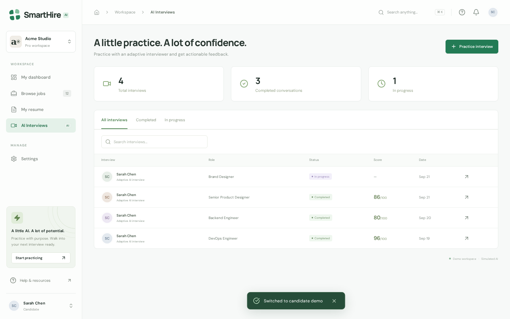
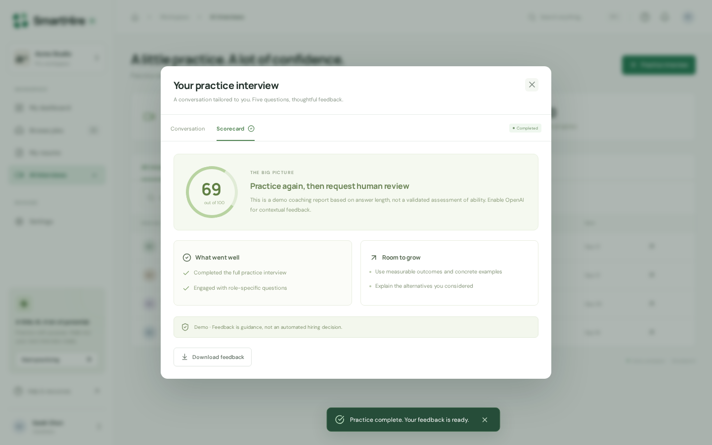

# SmartHire AI

SmartHire AI is a runnable recruitment workspace and interview-preparation MVP. It has two role-specific experiences in one tenant: recruiters manage jobs and candidate pipelines, while candidates browse jobs, attach a resume, apply, and practice a role-specific text interview.

The repository is deliberately honest about its scope. The demo is fully usable without provider credentials; connected OpenAI, Stripe, SMTP, PostgreSQL/RLS, and Docker paths are implemented as integration boundaries, but external provider calls and production operations still require configuration and review.

## What is in the repository

| Layer | Implementation | Entry point |
| --- | --- | --- |
| Browser app | React 19, TypeScript, Vite, TanStack Query, Recharts, Lucide, local DM Sans/Manrope fonts | `frontend/src/App.tsx` |
| API | FastAPI modular monolith with authentication, workspace, job, resume, application, interview, analytics, billing, and audit routers | `backend/app/main.py` |
| Persistence | SQLAlchemy models; SQLite for the local demo; PostgreSQL migration path with forced RLS policies | `backend/app/models/entities.py`, `backend/alembic/versions/0001_initial.py` |
| Interview engine | LangGraph `StateGraph` with question, answer evaluation, follow-up, and scorecard nodes | `backend/app/ai/interview.py` |
| AI provider boundary | Demo keyword/cosine scoring or optional OpenAI structured parsing, embeddings, questions, evaluation, and scorecard generation | `backend/app/ai/provider.py` |
| Delivery | Dockerfiles, Compose, Nginx reverse proxy, Alembic, GitHub Actions | `docker-compose.yml`, `.github/workflows/ci-cd.yml` |

## Screenshots from the running app

These are real browser captures of the seeded application, not generated mockups. Each image is 1440 × 900 px in the default light theme. They were captured after starting the FastAPI API and Vite frontend and exercising the demo UI.

| Recruiter dashboard | Candidate portal |
| --- | --- |
|  |  |

| AI interview | Completed scorecard |
| --- | --- |
|  |  |

## Run locally

### Prerequisites

- Python 3.11+; CI uses Python 3.12.
- Node.js 22+.
- A browser for manual use. The automated browser workflow uses Playwright Chromium.

### API and Vite development servers

From the repository root:

```bash
python -m venv .venv
source .venv/bin/activate
pip install -r backend/requirements.txt
cp .env.example backend/.env

# Terminal 1
cd backend
uvicorn app.main:app --host 0.0.0.0 --port 8000

# Terminal 2, from the repository root
cd frontend
npm ci
npm run dev -- --port 5173
```

Open <http://localhost:5173>. Vite proxies `/api` to the API, so the browser uses relative URLs and never calls `localhost` directly. API documentation is available at <http://localhost:8000/api/docs>.

The default configuration is a local SQLite database with `DEMO_MODE=true`. On API startup, `seed_demo()` creates the fictional Acme Studio workspace once. It creates 12 active jobs, recruiter and candidate accounts, resumes, applications, completed interview fixtures, and audit activity. The fixtures are intentionally fictional and are not a substitute for production data.

### Demo accounts

| Role | Email | Password | Workspace |
| --- | --- | --- | --- |
| Recruiter/admin | `alex@acme.design` | `DemoPass2026!` | `acme` |
| Candidate | `sarah.chen@example.com` | `DemoPass2026!` | `acme` |

The first demo visit signs in as the recruiter. Use the profile menu at the bottom-left and choose **Try candidate view** to switch roles. The `/api/auth/demo` endpoint is only available while `DEMO_MODE=true`.

### Docker Compose

Compose runs PostgreSQL, Redis, a migration job, FastAPI, a Celery email worker, and an unprivileged Nginx frontend:

```bash
cp .env.example .env
# For a local browser, keep FRONTEND_URL=http://localhost:8080.
docker compose up --build
```

Open <http://localhost:8080>. The API uses the restricted `smarthire_app` PostgreSQL role after the one-shot migration runs as the owner. The database and Redis are not published to host ports. `infra/init-db.sh` creates the application role only during first database initialization; changing its password later requires a real database credential rotation.

Do not deploy the example secrets or demo fixtures. Compose is a local deployment stack, not a complete TLS, backup, monitoring, or secret-management solution.

## Verified application behavior

The descriptions below are based on the current source and the test suite, not product assumptions.

### Recruiter workspace

- Overview loads metric cards from `/api/dashboard/recruiter/analytics`, the application chart, hiring funnel, top matches, and active job cards.
- Recruiters can create, edit, close, search, and filter jobs. Free workspaces are limited to three active jobs by the API; the seeded Acme workspace is Pro.
- Candidate rows expose match score, role, status, resume summary, skills, experience, education, and interview transcript/scorecard when present.
- Candidate status changes are validated by the API and recorded in `AuditLog`.
- Analytics supports 7-, 30-, and 90-day periods and exports CSV from the browser. The API calculates current-period applications, interviews, match average, shortlist count, six chart buckets, and funnel stages.
- Team members, workspace settings, billing plans, help content, and an interactive API-docs link are exposed in the UI.

### Candidate portal

- Candidates see only active jobs in their tenant, can search by title/skill, and can open a job detail modal.
- Resume uploads accept PDF or DOCX only, cap the file at 5 MB and PDF length at 25 pages, validate document structure, extract text, and persist parsed JSON rather than the original file.
- Applying requires a resume, stores the resume ID used for that application, calculates a match score, and rejects duplicate applications.
- The candidate dashboard shows applications, match scores, status, and practice-interview actions.
- The interview experience is a five-question text flow. State and transcript are persisted after each turn, and the final scorecard can be downloaded as JSON.

### Authentication and tenancy

- Signup creates a new tenant only for the tenant-admin role; candidate signup must name an existing workspace.
- Access JWTs expire after 15 minutes and stay in browser memory. Refresh JWTs are stored as HTTP-only, SameSite cookies, hashed in the database, rotated on refresh, and revoked on logout.
- Passwords use direct bcrypt hashing. Email verification and password-reset action tokens are purpose-specific, single-use, time-limited records.
- API dependencies enforce tenant scope and role permissions. PostgreSQL migration policies use `FORCE ROW LEVEL SECURITY`; SQLite validates application-level isolation only.

## Demo AI and connected AI

The footer in the browser labels the active mode. The two modes are intentionally different:

| Capability | Without `OPENAI_API_KEY` | With `OPENAI_API_KEY` |
| --- | --- | --- |
| Resume parsing | Known-skill keyword extraction; experience and education remain empty | Native Pydantic structured output from the configured OpenAI model |
| Matching | Required-skill overlap percentage | `text-embedding-3-small` cosine similarity, bounded to 0–100 |
| Interview questions | Role/skill templates with a length-based follow-up branch | Structured contextual question from the role, resume, and conversation state |
| Answer evaluation | Word-count demo score and guidance | Structured relevance, specificity, technical-depth evaluation |
| Scorecard | Clearly labeled demo coaching feedback | Structured contextual feedback with human-review language |

Resume, job-description, and answer text is cleaned and passed as untrusted data. The provider system prompt instructs connected AI not to use protected attributes, infer psychological confidence, follow document instructions, or make autonomous hiring decisions. These are defense-in-depth measures, not a guarantee against prompt injection or a replacement for privacy, bias, retention, and legal review. Do not send real applicant data to a connected provider until appropriate consent and contractual controls are in place.

## Optional integrations

### OpenAI

Set `OPENAI_API_KEY` and optionally `OPENAI_MODEL` in `backend/.env`, then restart the API. Provider failures are surfaced as API errors; the application does not silently turn a failed provider request into fake connected-AI output. Embeddings are currently computed per application and are not persisted or indexed in Qdrant/Chroma.

### Email

Set `SMTP_HOST`, `SMTP_PORT`, `SMTP_USER`, `SMTP_PASSWORD`, and `EMAIL_FROM`, run Redis, and start the worker:

```bash
cd backend
celery -A app.tasks.email.celery worker --loglevel=info
```

The verification and password-reset routes queue email only when SMTP is configured. In demo mode, action tokens are returned by the API so local flows can be exercised without an email account. A production rollout should add a transactional outbox before treating delivery as durable.

### Stripe test mode

Set `STRIPE_SECRET_KEY`, `STRIPE_PRO_PRICE_ID`, and `STRIPE_WEBHOOK_SECRET`. The API exposes Checkout creation for tenant admins and signature-verified subscription webhooks. The demo UI displays plans, but payments remain disabled until valid Stripe configuration is supplied. Enterprise billing, a customer portal, and downgrade workflows are not implemented.

## Tests, lint, and build

The following checks were run successfully in this working session:

```bash
# Backend
.venv/bin/ruff check backend
.venv/bin/ruff format --check backend
cd backend
../.venv/bin/pytest -q
# 16 passed

# Frontend
cd ../frontend
npm ci
npm run lint
npm run build
# Prettier check passed; strict TypeScript/Vite build passed

# Browser workflows; PATH must resolve python to the project venv
rm -f ../backend/e2e.db
CI=1 \
BROWSER_PATH=/path/to/chromium \
PATH="$(pwd)/../.venv/bin:$PATH" \
npm run test:e2e
# 4 passed
```

The browser suite covers recruiter candidate review and job lifecycle, a complete candidate interview and download, mobile navigation/search without horizontal overflow, and logout/session refresh behavior. Docker image builds, live OpenAI calls, live Stripe calls, live SMTP delivery, and a real PostgreSQL service are not claimed by the local checks above.

## Production gate and known boundaries

`ENVIRONMENT=production` refuses startup unless demo mode is disabled, the secret key is at least 32 characters, PostgreSQL is selected, the frontend URL is HTTPS, and OpenAI plus SMTP are configured. Before any real deployment:

1. Start with a fresh database and no demo fixtures.
2. Use unique secrets from a secret manager and rotate database credentials deliberately.
3. Run migrations with the owner role and application requests/workers with the restricted non-owner role.
4. Put Nginx behind managed TLS or configure TLS directly; do not expose the API, database, or Redis publicly.
5. Configure exact CORS origins, SMTP sender DNS, Stripe callbacks, backups, restore drills, retention/deletion workflows, request limits, monitoring, and accessibility/security review.
6. Validate matching and coaching quality with a reviewed dataset. Scores are similarity/coaching signals, not calibrated hiring probabilities.

Intentional MVP boundaries include cross-company candidate identity and marketplace search, recruiter invitations and granular permissions, durable embedding indexes, queued resume parsing, streamed/audio/video interviews, scheduling, object storage and antivirus scanning, OCR, candidate deletion/export workflows, DB-side pagination for large workspaces, usage metering, monitoring integrations, and cloud deployment wiring.

See [docs/ARCHITECTURE.md](docs/ARCHITECTURE.md) for the code-level trust boundaries and state model. See [docs/OPERATIONS.md](docs/OPERATIONS.md) for local operations, deployment runbooks, failure handling, and verification commands.
